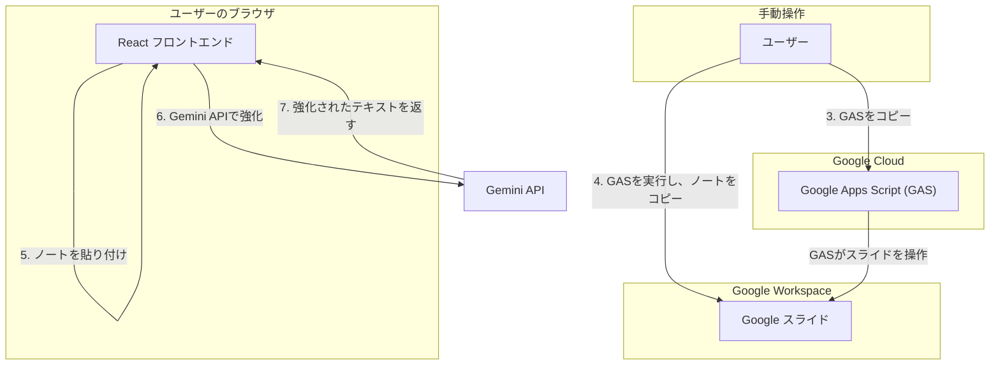

# Script Maker

このプロジェクトは、Google スライドのスピーカーノートを効率的に管理・活用するための多機能 Web アプリケーションです。Gemini API と Google Apps Script (GAS) を組み合わせることで、ノートの抽出、整形、AI による強化、そしてスライドへの一括更新までをシームレスに行います。

## 主な機能

*   **ノート抽出スクリプトの生成:**
    *   Google スライドの URL を入力するだけで、スピーカーノートを抽出するための Google Apps Script (GAS) を自動生成します。
*   **手動入力と Markdown 整形:**
    *   抽出したノート（または手入力したテキスト）を貼り付け、スライドごとに区切られた整形済みの Markdown に変換します。
*   **AI によるノート強化:**
    *   Google の Gemini API を利用して、生成された Markdown の内容を自動で要約・強化し、より洗練されたスクリプトを提案します。
*   **Markdown からスライドへの一括更新:**
    *   Markdown 形式で編集したノートを、元の Google スライドに一括で反映させるための GAS を生成します。フォントの種類やサイズも指定可能です。
*   **全ノートのクリア:**
    *   プレゼンテーション内の全スライドのスピーカーノートを、一括で削除するための GAS を生成します。

## 技術スタック

*   **フロントエンド:** React, TypeScript, Vite
*   **AI:** Google Gemini API (`@google/genai`)
*   **スクリプティング:** Google Apps Script (GAS)

## アーキテクチャ

このアプリケーションは、ユーザーのブラウザで動作する React フロントエンドと、Google スライドを操作するための Google Apps Script (GAS) で構成されています。



1.  **ノートの抽出:**
    1.  ユーザーが React アプリ上で Google スライドの URL を入力します。
    2.  アプリが、そのスライドからノートを抽出するための **GAS コードを生成**し、ユーザーに提示します。
    3.  ユーザーは提示された GAS コードをコピーし、対象スライドの Apps Script エディタに貼り付けて実行します。
    4.  GAS がスライドの全ノートを抽出し、サイドバーに表示します。ユーザーはそのテキストをコピーします。
    5.  コピーしたノートを React アプリに貼り付け、「マークダウンに変換」ボタンを押します。
2.  **AI による強化と更新:**
    6.  ユーザーは「AIで強化」ボタンを押し、整形済み Markdown を Gemini API に送信します。
    7.  Gemini API が内容を要約・改善し、結果を返します。
    8.  ユーザーは「Markdownからノート更新」タブで、更新したい内容（AIが生成したものなど）を貼り付け、フォント設定などを行い、「更新スクリプトを取得」ボタンを押します。
    9.  アプリが、スライドのノートを一括更新するための GAS コードを生成します。ユーザーはこれをコピーし、再度 Apps Script エディタで実行することで、スライドのノートが一度に更新されます。

## ローカルでの実行方法

**前提条件:**
*   Node.js (v18 以上を推奨)
*   Google アカウント

**手順:**

1.  **依存関係のインストール:**
    ```bash
    npm install
    ```

2.  **環境変数の設定:**
    プロジェクトのルートに `.env` という名前のファイルを作成し、お使いの Gemini API キーを設定します。

    ```
    VITE_GEMINI_API_KEY=YOUR_API_KEY
    ```
    `YOUR_API_KEY` の部分を、実際の Gemini API キーに置き換えてください。

3.  **開発サーバーの起動:**
    ```bash
    npm run dev
    ```
    コマンドを実行すると、ローカルサーバーが起動します（通常は `http://localhost:5173`）。ブラウザでこの URL にアクセスしてください。

## Google Apps Script の実行について

このアプリケーションでは、ユーザー自身の権限で Google スライドを操作するため、Google Apps Script のコードを生成し、ユーザーに手動で実行してもらう方式を採用しています。これにより、アプリケーションがユーザーの認証情報を直接保持する必要がなくなり、セキュリティが向上します。

スクリプトの初回実行時には、Google から権限の承認を求めるプロンプトが表示されます。内容を確認の上、許可してください。